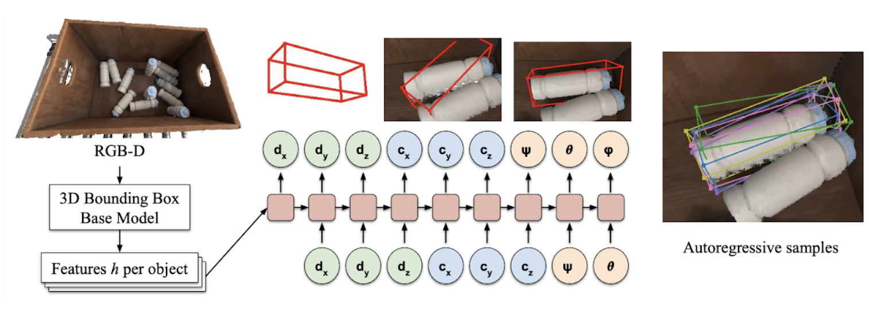
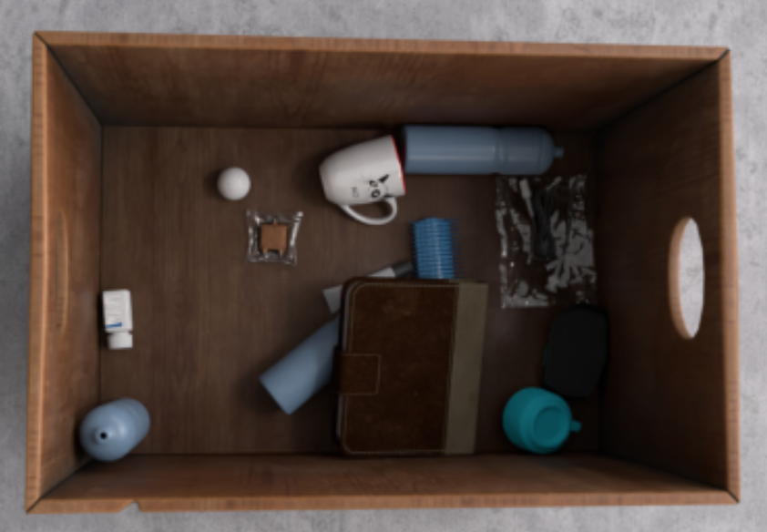
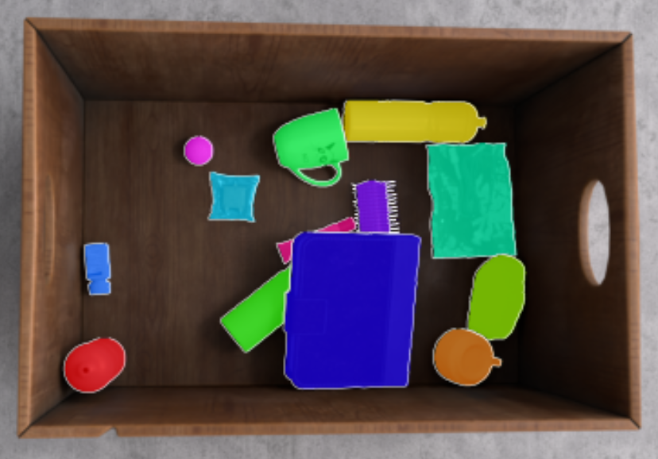

# Autoregressive Uncertainty Modeling for 3D Bounding Box Prediction
### [Project Page](https://bbox.yuxuanliu.com) | [Paper]() | [Data](https://drive.google.com/drive/u/1/folders/1dIH3SjsrWbSMvXIfrwcocQbM_73Io0vC)

Pytorch implementation of our autoregressive model formulation for 3D bounding-box estimation & detection. 

[Autoregressive Uncertainty Modeling for 3D Bounding Box Prediction](https://bbox.yuxuanliu.com)  
 [YuXuan Liu](https://yuxuanliu.com/)1,2,
 [Nikhil Mishra](https://nikhilmishra000.github.io/)1,2,
 [Maximilian Sieb](https://msieb1.github.io/)1,
 Yide Shentu1,2,
 [Pieter Abbeel](https://people.eecs.berkeley.edu/~pabbeel/)1,2,
 [Xi Chen](https://peterchen.us/)1  
 1Covariant.ai, 2UC Berkeley \
in ECCV 2022 

  

### Autoregressive 3D Bounding Box Estimation
3D bounding-box estimation assumes that 2D object segmentation has already been performed through any type of segmentation model, e.g. Mask R-CNN. Our autoregressive bounding box estimation model can be found under [autoreg-bbox](autoreg-bbox). 

Python dependencies are listed in `requirements.txt` and can be installed via `pip install -r requirements.txt`
We provide two Jupyter notebooks:
1. [visualize_data.ipynb](autoreg-bbox/visualize_data.ipynb) which lets you visualize data samples from our new dataset `COB-3D`. We provide code to visualize 2D masks and 3D bounding boxes.
2. [inference_example.ipynb](autoreg-bbox/inference_example.ipynb) which lets you run inference with our newly proposed model architecture for the 3D Bounding Box Estimation task. We provide trained model weights which you can download [here](https://drive.google.com/drive/u/1/folders/1dIH3SjsrWbSMvXIfrwcocQbM_73Io0vC). Any use the the dataset, code, and weights is subject to our [CC Attribution-NonCommercial-ShareAlike License](LICENSE).
  

### Autoregressive 3D Bounding Box Detection

3D bounding box detection predicts 3D bounding box directly from a point cloud.

We forked repos from two SOTA methods for the detection task, i.e. FCAF3D and PVRCNN, and implemented our autoregressive head on top. The augmented code can be found under the respective folders [autoreg-fcaf3d](autoreg-fcaf3d) and [autoreg-pvrcnn](autoreg-pvrcnn).
  
### COB-3D Dataset
You can download our newly published dataset for common objects in bins for robotic picking applications [here](https://drive.google.com/drive/u/1/folders/1dIH3SjsrWbSMvXIfrwcocQbM_73Io0vC). Any use the the dataset, code, and weights is subject to our [CC Attribution-NonCommercial-ShareAlike License](LICENSE). All of the data was created by [Theory Studios](https://www.theorystudios.com/).

Each data point contains the following:

- RGB image of shape (H, W, 3)
- Depth map of shape (H, W)
- Intrinsic Matrix of the camera (3, 3)
- Normals Map of shape (H, W, 3)
- Instance Masks of shape (N, H, W) where N is the number of objects
- Amodal Instance masks of shape (N, H, W) which includes the occluded regions of the object
- 3D Bounding Box of each object (N, 9) as determined by dimensions, center, and rotation.

For more info and example code on how to load & interact with the data, refer to the [visualize_data.ipynb](autoreg-bbox/visualize_data.ipynb) Jupyter notebook.

### License 
Shield: [![CC BY-NC-SA 4.0][cc-by-nc-sa-shield]][cc-by-nc-sa]

This work, including the paper, code, weights, and dataset, is licensed under a
[Creative Commons Attribution-NonCommercial-ShareAlike 4.0 International License][cc-by-nc-sa].

[![CC BY-NC-SA 4.0][cc-by-nc-sa-image]][cc-by-nc-sa]

[cc-by-nc-sa]: http://creativecommons.org/licenses/by-nc-sa/4.0/
[cc-by-nc-sa-image]: https://licensebuttons.net/l/by-nc-sa/4.0/88x31.png
[cc-by-nc-sa-shield]: https://img.shields.io/badge/License-CC%20BY--NC--SA%204.0-lightgrey.svg
