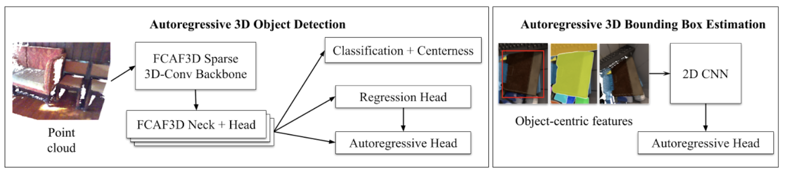

# Autoregressive Uncertainty Modeling for 3D Bounding Box Prediction
### [Project Page](https://sites.google.com/view/autoreg-bbox) | [Paper]() | [Data](https://drive.google.com/drive/u/1/folders/1dIH3SjsrWbSMvXIfrwcocQbM_73Io0vC)

Pytorch implementation of our autoregressive 3D bounding box model for 3D bounding-box estimation & detection tasks. 

[Autoregressive Uncertainty Modeling for 3D Bounding Box Prediction](https://sites.google.com/view/autoreg-bbox)  
 [YuXuan Liu](https://yuxuanliu.com/)1,2,
 [Nikhil Mishra](https://nikhilmishra000.github.io/)1,2,
 [Maximilian Sieb](https://msieb1.github.io/)1,
 [Yide Shentu]()1,2,
 [Pieter Abbeel](https://people.eecs.berkeley.edu/~pabbeel/)1,2,
 [Xi Chen](https://peterchen.us/)1  
 1Covariant.ai, 2UC Berkeley \
in ECCV 2022 

### Autoregressive 3D Bounding Box Estimation

3D bounding-box estimation assumes that 2D object segmentation has already been performed through any type of segmentation model, e.g. Mask R-CNN.

Python dependencies are listed in `requirements.txt` and can be installed via `pip install -r requirements.txt`
We provide two Jupyter notebooks:
1. `visualize_data.ipynb` which lets you visualize data samples from our new dataset `COB-3D`. We provide code to visualize 2D masks and 3D bounding boxes.
2. `inference_example.ipynb` which lets you run inference with our newly proposed model architecture for the 3D Bounding Box Estimation tasks (-> predicting 3D bounding boxes from 2D segmentation.) 

### Autoregressive 3D Bounding Box Detection

3D bounding box detection predicts 3D bounding box directly from a point cloud.

We forked repos from two SOTA methods for the detection task, i.e. FCAF3D and PVRCNN, and implemented our autoregressive head on top. The augmented code can be found under the respective folders `autoreg-fcaf3d` and `autoreg-pvrcnn`.